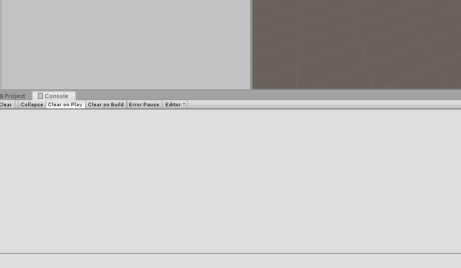

# UnityTask

Simple task system


## How to use:

``` 
 public class LogTask : Task
 {
            private string msg;

            public LogTask(string msg)
            {
                this.msg = msg;
            }

            protected override void OnExecute()
            {
                MonoManager.current.StartCoroutine(Test(1));
            }

            IEnumerator Test(float waittime)
            {
                yield return new WaitForSeconds(waittime);
                Debug.Log(msg);
                EndAction();
            }
 }
```


```
TaskList sequenceTask = new TaskList(TaskList.ActionsExecutionMode.RunInSequence);
            sequenceTask.AddTask(new LogTask("顺序测试1"));
            sequenceTask.AddTask(new LogTask("顺序测试2"));
            sequenceTask.AddTask(new LogTask("顺序测试3"));
            
            TaskList parallelTask = new TaskList(TaskList.ActionsExecutionMode.RunInParallel);
            parallelTask.AddTask(new LogTask("并行任务测试1"));
            parallelTask.AddTask(new LogTask("并行任务测试2"));
            parallelTask.AddTask(new LogTask("并行任务测试3"));
            
//            TaskList task = new TaskList(TaskList.ActionsExecutionMode.RunInSequence);//顺序执行
            TaskList task = new TaskList(TaskList.ActionsExecutionMode.RunInParallel);//并行执行
            task.AddTask(sequenceTask);
            task.AddTask(parallelTask);
            task.Execute(this, success =>
            {
                Debug.Log("所有任务执行完毕"+success);
            });
```


## example:

open  YKFramwork\Task\Example\Scenes\SampleScene.scene


## Preview:
